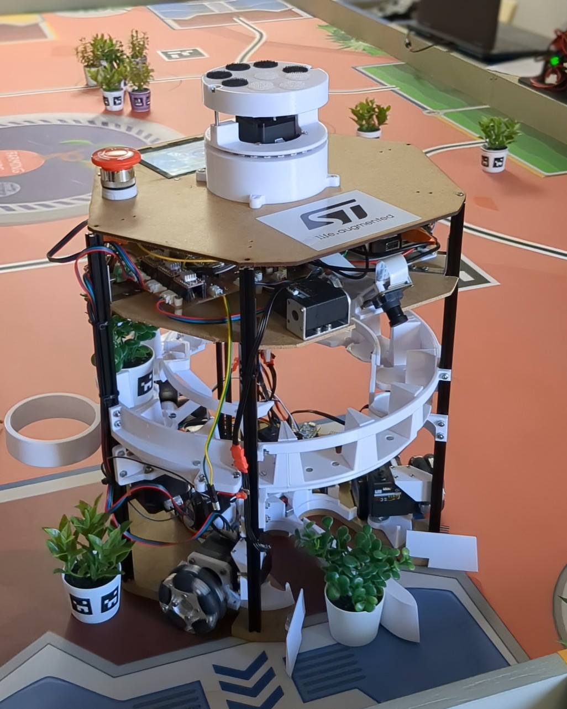
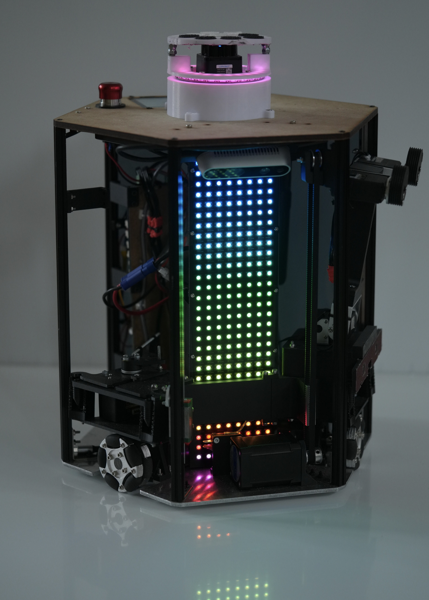

# Coupe de France de Robotique 2026 : Code ROS2 + STM32 + PAMI (ESP32)

|2024 robot|2025 robot|
| -------- | -------- |
|||


## Other helpful Readme(s) :

* [How to ? And Traps !](docs/HowToREADME.md)
* [marker_helper library](champi_libraries_py/champi_libraries_py/marker_helper/README.md)
* **[Champi Brain Documentation](champi_brain/docs/README.md)** - Strategy system and state machine
  * [Table Symmetry Management](champi_brain/docs/table_symmetry.md)

### 📹 **Simulation et Vision**
* [**Champi Webots**](champi_webots/README.md) - Configuration of webots simulation and simulated camera
* [**Champi Watchtower**](champi_watchtower/README.md) - External camera code

## Setup the project on your computer

Requirements :
- Ubuntu 24
- ROS2 Jazzy

Let's start :
1) Make sure your workspace is `~/champi_ws`. The scripts are hardcoded to this path.
2) Install dependencies with the following command. If something fails, correct the error and relaunch the script.
```shell
~/champi_ws/src/champi_robot_ros/setup/install_deps.sh
```
3) Setup the environment (exports, aliases, etc.) by adding one of those line in your `.bashrc` or `.zshrc`:
```shell
source ~/champi_ws/src/champi_robot_ros/setup/env/champi_env_dev_pc.sh # on your PC
# or
source ~/champi_ws/src/champi_robot_ros/setup/env/champi_env_robot.sh # on the robot 
```
4) Then add also this line to your `.bashrc` or `.zshrc`. If you're using zsh, replace with `setup.zsh`
```shell
source ~/champi_ws/install/setup.bash
```

5) Make sure to source the file `.bashrc` or `.zshrc`
```shell
source ~/.bashrc
```

6) Optional. Link the default rviz config file to the one we customized so that it opens by default:
```shell
ln -s ~/champi_ws/src/champi_robot_ros/champi_bringup/config/rviz/config.rviz ~/.rviz2/default.rviz
```

### Tips for CLion:
We recommend using CLion to code.
1. When opening the project, a lot of build directories are displayed in the project tree.
Remove them by un-ticking `clion.workspace.external.source.group.into.folders` in Registry (Search in Shift Shift menu).
2. You can easily add scripts to run directly via a button in CLion. Next to the green arrow on the top bar, click `Edit configurations` and add a new configuration to run a bash script or a command.
We usually use it for commands such as `build`, `build and send STM32 code to the STM via the robot connection`, `reset the STM remotly from your computer`.

### Build the project
Sourcing the script `champi_env_dev_pc.sh` added aliases in your terminal to simplify building the project. You can now run `build` from anywhere to compile the workspace.
```shell
build
```
You can also add options to this command. Those options are the same that for the original `colcon build` used to compile in ros2 projects (refer to ros2 docs for more examples). For instance if you only want to compile the package `my_package` to save time on compilation :
```shell
build --packages-up-to my_package
```

## Launching locally in simulation

Open Rviz2 and load the config file `champi_ws/src/champi_robot_ros/champi_bringup/config/rviz/config.rviz` to visualize the robot in simulation. Then launch the following command to launch the robot in simulation with Gazebo and Rviz2:
```shell
rviz2 -d ~/champi_ws/src/champi_robot_ros/champi_bringup/config/rviz/config.rviz
```
```shell
 ros2 launch champi_bringup bringup.launch.py sim:=true nav:=true brain:=true sensors:=false
```

## Launching on the robot

When booting, the mini-PC will automatically launch the `champystem.service` systemd service that launches the ROS2 nodes. So you don't have to do anything to launch the code on the robot.

If you want to stop the code, you can simply stop the service with the alias `champystop`. Then you can restart it with `champystem`.
This service opens a tmux session that you can attach to with the command `attach`.

See the file [champi_env_robot.sh](setup/env/champi_env_robot.sh) to see all configured aliases.

## Useful scripts

1. To connect to the robot via ssh, you must be connected on the same network as the robot. So make sure you are either connected to the Access Point created by the robot: `champiAP` or by ethernet. Then
```shell
ssh champi@172.0.0.1 # Over WiFi
ssh champi@10.0.0.1  # With direct ethernet
```

2. Every time you want to share your internet connection with the robot, run `share_internet`/

3. Coding directly on the robot via SSH is painful... So you can code on your computer and then run the command `rsync_update`. This will sync everything in the `champi_robot_ros` folder. Then just build the code on the robot and relaunch it !


4. If you have trooble with nodes that you can't kill. Use the script `kill_nodes` on the robot. This script has hardcoded nodes names, so if you created a new one add it in it. Otherwise you can simply open htop on the robot via ssh and find all nodes and kill them there.

5. If you want to program the STM32 remotly via the connection to the robot you can ! This is a super useful script that cross-compile the STM32 firmware on your computer, sends the compiled binary to the robot mini-pc and then flash it to the STM board via USB. (STM32 CLI must be installed first)
```shell
./scripts/cmds/rsync_main_STM.bash
```

6. Similarly you can reset the STM32 remotly without having to get up and have access to the robot :)
```shell
./scripts/cmds/reset_main_STM.bash
```

7. You can monitor STM32's logs directly on your computer. First `ssh` on the robot, then find if the STM is connected via USB on `ACM0` or `ACM1` with `ls /dev/ttycACM*`. Then accordingly run:
```shell
serial_monitor0 # for ACM0
# or
serial_monitor1 # for ACM1
```

8. If you encounter problems with the robot's access point/hotspot you can try to restart the dchcp:
```shell
sudo systemctl restart isc-dhcp-server
```


## Notes

### setup.py deprecation warning

No solution currently for the warning : https://github.com/ament/ament_cmake/issues/382


### install stm32cubeide
- version 1.18
- make sure to login to your st account on the IDE
