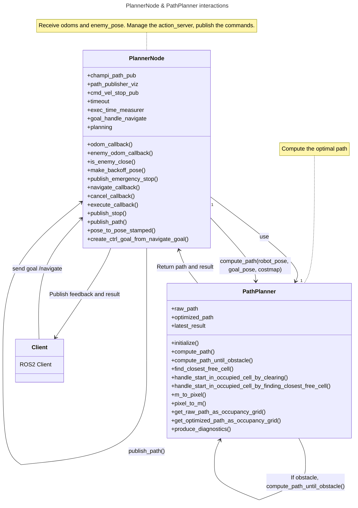

```mermaid
---
title: PlannerNode & PathPlanner interactions
---
classDiagram
    %% Main Classes
    class PlannerNode {
        +odom_callback()
        +enemy_odom_callback()
        +is_enemy_close()
        +make_backoff_pose()
        +publish_emergency_stop()
        +navigate_callback()
        +cancel_callback()
        +execute_callback()
        +publish_stop()
        +publish_path()
        +pose_to_pose_stamped()
        +create_ctrl_goal_from_navigate_goal()
        +champi_path_pub
        +path_publisher_viz
        +cmd_vel_stop_pub
        +timeout
        +exec_time_measurer
        +goal_handle_navigate
        +planning
    }
    class PathPlanner {
        +initialize()
        +compute_path()
        +compute_path_until_obstacle()
        +find_closest_free_cell()
        +handle_start_in_occupied_cell_by_clearing()
        +handle_start_in_occupied_cell_by_finding_closest_free_cell()
        +m_to_pixel()
        +pixel_to_m()
        +get_raw_path_as_occupancy_grid()
        +get_optimized_path_as_occupancy_grid()
        +produce_diagnostics()
        +raw_path
        +optimized_path
        +latest_result
    }

    %% Relations
    PlannerNode "1" --> "1" PathPlanner : use

    %% Main Interactions
    Client : ROS2 Client
    Client --> PlannerNode : send goal /navigate
    PlannerNode --> PlannerNode : navigate_callback()
    PlannerNode --> PlannerNode : execute_callback()
    PlannerNode --> PathPlanner : compute_path(robot_pose, goal_pose, costmap)
    PathPlanner --> PathPlanner : Check obstacles, compute path
    PathPlanner --> PathPlanner : If obstacle, compute_path_until_obstacle()
    PathPlanner --> PlannerNode : Return path and result
    PlannerNode --> PlannerNode : Check if enemy is close
    PlannerNode --> PlannerNode : If enemy is close, make_backoff_pose()
    PlannerNode --> PlannerNode : publish_emergency_stop()
    PlannerNode --> PlannerNode : publish_stop()
    PlannerNode --> PlannerNode : publish_path()
    PlannerNode --> Client : Publish feedback and result

    %% Notes explicatives
    note for PlannerNode "Receive odoms and enemy_pose. Manage the action_server, publish the commands."
    note for PathPlanner "Compute the optimal path"
```